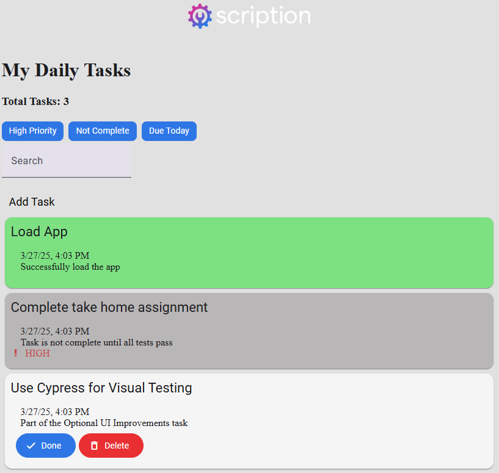

# Task App Coding Assignment

## Introduction

This assignment was a take home assignment for a Full Stack Engineer (Front-End Focused) position.
The task was to update the _very_ barebones client application by adding features, updating the UX and improving the reliability.
The task was front-end focused, so no improvements were required for the back-end.

At the time of attempting this assignment, I had no knowledge of coding with Angular, Cypress or Nx, and had minimal experience coding with Jest.

## Task

The task was to update / add the requested features. Specifically:

1. **Add** - COMPLETED

   Users aren't able to add tasks to their list

   - User should navigate to a form when clicking `Add Task`
   - Form should only allow tasks to be created which have a title of **at least 10 characters**
   - Added task should be included in the task list
   - User should be navigated back home if adding or canceling the form.

2. **Filter**  - COMPLETED

   Users can only filter the list for `Not Completed` tasks

   - Add filtering for `High Priority` tasks
   - Add filtering for `Due Today` tasks

3. **Simple Search**  - COMPLETED

   Users can't search for tasks based on title

   - Implement a simple search that searches for all tasks that contain the search term in it's **title**
   - Clearing the search should reload all tasks

4. **Add Date Picker (Optional)**  - COMPLETED

   Users can't set the scheduled date when creating a task

   - Add a date picker to allow user to set the scheduled date
   - User can only select a date within the next **7 days**
   - Add test coverage for this new feature

5. **Fuzzy Search (Optional)**

   Users aren't good at spelling when searching for tasks

   - Upgrade our simple search implementation to fuzzy search
   - Add test coverage for this new feature
   - You are allowed to use an npm package to help implement this feature such as fuse.js
   - e.g. searching with value _hoem_ should return tasks that include _home_ in title

6. **UX Improvements (Optional)**  - COMPLETED

   Users aren't excited using our application

   - Implement any UX improvements (e.g. styles, animations, alerts)
   - Add test coverage for this new features
   - Don't be shy to use icons and colors
   - Simplicity is the ultimate sophistication - Steve Jobs

## How to Run

You should start by installing the dependencies via npm by running `npm install` from the root folder.

The repository contains a backend server application, `packages/node-app`, a front-end web application `packages/web-app`, and a shared library `packages/shared`. All these apps and libraries are managed by [Nx](https://nx.dev/), a build system for monorepos.

You can serve the backend and frontend apps by running `npx nx run node-app:serve` and `npx nx run web-app:serve` respectively. Once the two apps are running, you should see the following page if you navigate to `localhost:4200` in a browser.

Each application also includes unit test suites than can be run with `npx nx run node-app:test` and `npx nx run web-app:test`. The test suites are written with the [Jest testing framework](https://jestjs.io/).

Visual test suites are also included for the front-end. First ensure node-app is being served. Then run `npx nx e2e web-app`. The visual test suites are written with [Cypress](https://www.cypress.io/)
